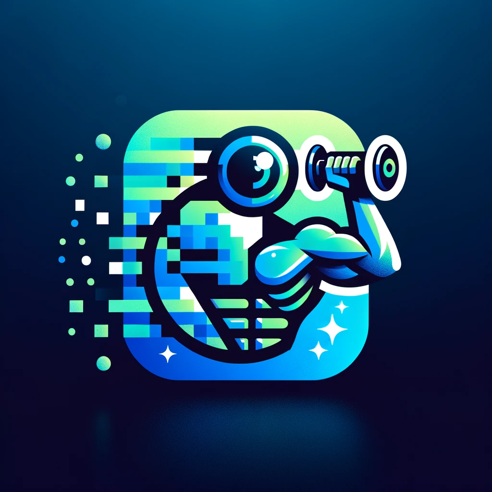

 

  

  <h3 align="center">Exercise Repetition Counter</h3>

  

    A cutting-edge project to detect repetitions in the gym!
     
     
    <a href="https://exercise-counter-mediapipe.streamlit.app/"><strong>View Demo »</strong></a>
     
     
  

## About The Project

This project contains the following folders:

- MEDIAPIPE [SOLUTION] -> Our first solution using mediapipe and demo
- mmaction -> Exercise detection
- REPCOUNT POSE [SOLUTION] -> Second solution using PoseRAC
- VIDEOS [TESTING] -> Some of the videos we used to test the app
- YOLO+REPNET -> Human Detection using YOLO and Repnet to count repetitions
- yolov8pose -> Pose estimation with YOLO pose

## License

Distributed under the MPL-2.0 License. See [LICENSE](https://github.com/ShaanCoding/ReadME-Generator/blob/main/LICENSE.md) for more information.

## Authors

- **Jorge Garcia** - [gor2000](https://github.com/gor2000/)
- **Vanessa Vega** - [vvegav](https://github.com/vvegav)
- **Leopold Von Hugo** - 
- **Eki Akhigbe** - [ekiomo](https://github.com/ekiomo)
- **Regina de Alba** - [reginadealbahe](https://github.com/reginadealbahe)
